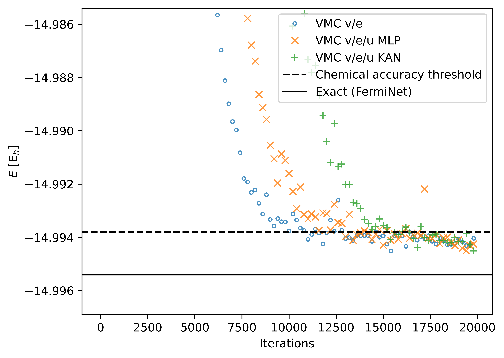

# netket-kan: Kolmogorov-Arnold Networks for Neural Quantum States

---

### 📖 Overview


netket-kan is the result of a semester project in Giuseppe Carleo's Computational Quantum Physics Lab under the supervision of David Linteau. It aimed at integrating Kolmogorov-Arnold Networks (KANs) into the [NetKet](https://github.com/netket/netket) framework, enabling their use as variational ansatzes for Variational Monte Carlo (VMC) simulations of molecular systems.

#### Disclaimers:
  - David Linteau (@dalin27) wrote the vast majority of the code and had the kindness to share it with me
  - The actual Neural-Network Quantum States used in this project are not available on this repository, the corresponding publication not being yet published

---

### 🛠 Installation

Prerequisites:

* [NetKet](https://www.netket.org/) - Machine learning framework for quantum many-body problems.
* [JAX](https://github.com/google/jax) - Autograd and XLA for high-performance ML research.
* [Flax](https://github.com/google/flax) - A neural network library for JAX.
* [jaxKAN](https://github.com/srigas/jaxKAN) - A machine learning library designed to allow Kolmogorov-Arnold Networks in JAX.


```
# Clone the repository
git clone https://github.com/tjobin/netket-kan.git
cd netket-kan

# Install dependencies - made for CPU use !
pip install -r requirements.txt
```

*Note: if you are using GPU acceleration, ensure you have the appropriate version of [NetKet](https://netket.readthedocs.io/en/latest/install.html) and [JAX](https://docs.jax.dev/en/latest/installation.html#installation) installed*

---

### 🚀 Usage

#### Create appropriate folders

```
# Create folder for data and log files:
mkdir data_log

# Create folder for figures
mkdir plots
```
#### Set up the simulation in main.py

- Define the molecule of interest and create the pyscf `mol` object
- Instantiate the ansatz
- Define the sampler hyperparameters and instantiate it
- Define the optimizer hyperparameters and instantiate it
- Instantiate the `netket.operator` object representing the Hamiltonian of the system
- Instantiate the `netket.vqs.MCState` object representing the states sampled by the sampler
- Instantiate the `netket.VMC` object and run the simulation 

### 📊 Results

Preliminary results show that KANs seem to decrease the convergence rate while retaining the same precision than MLPs with or without global features.

<p align="center">
  
    
  


